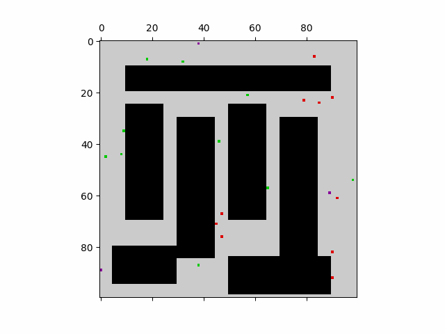

# 16350_project

In this project, we developed a centralized path planning algorithm that plans the transportation of multiple objects within a fully mapped 2d grid space, and with multiple robots available. The plan minimizes total time taken, and generates detailed paths for each robot to ensure no collision. The algorithm first utilizes A* search to calculate the distance between key nodes, then it uses a multi-agent traveling salesman algorithm to assign tasks and arrange order of execution. In the end, A* is used again to generate the detailed plan, and a collision avoidance algorithm checks the path for collisions and edit the path to avoid them if needed.

Demo: The robots pick up packages (green dots) and drop them at their respective destination (red dots)

